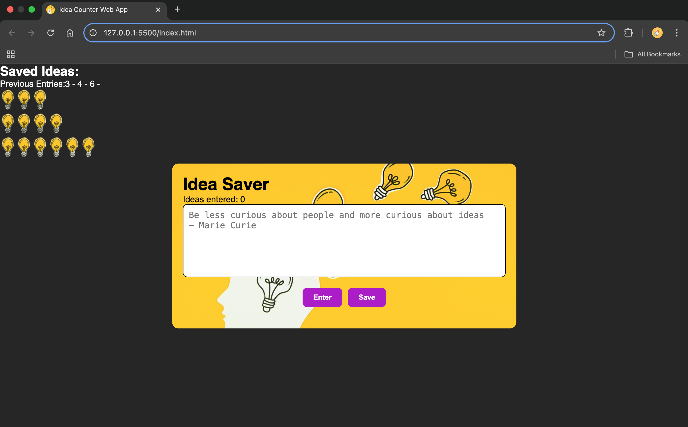

# Random Lights 
(work in progress)
Inspired by the "Build A Passenger Counter App" found on scrimba.com - Learn JavaScript for beginners AND an app possibly meant for saving insightful, reflective thoughts in a unique way, similar to the saying, "Try lighting a candle instead of cursing the darkness"; I believe I heard this from a Carl Sagan book titled: "The Demon Haunted World", hoping to add more features which may possibly encourage self-reflection, self-healing, self-improvement.

