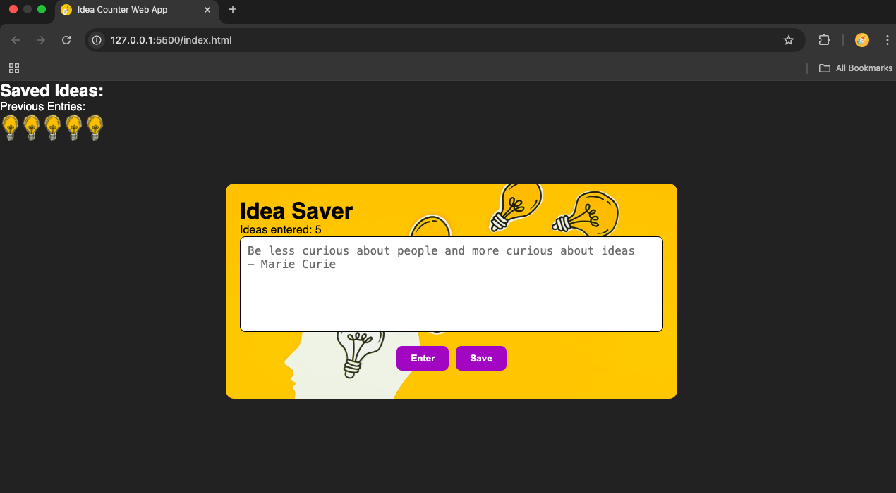
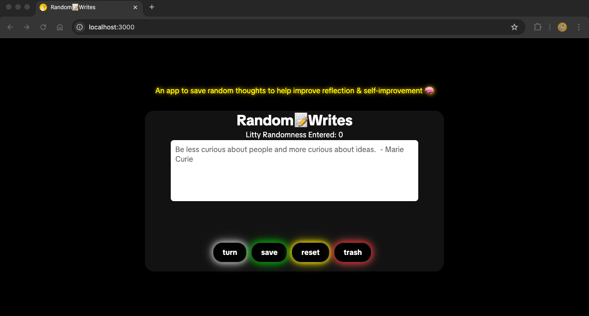

# Random Writes • Frontend 

## Frontend Tech Stack: 
HTML | CSS | JavaScript | Vite

## About
Simple & fun web-interface for recording thoughts.
Inspired by the **Build A Passenger Counter App** found on **scrimba.com - Learn JavaScript for beginners**

Save any random thought while online; sometimes when I get random thoughts and I start to write them down, I then begin to dig deeper and often reaize my random thoughts are sometimes trying to tell me a more important message.

## Future Features
Going to add backend and rdbms to make this a complete fullstack portfolio project. 

## backend tech stack should include: 
Java | Spring | Spring-Boot | Postgresql | SQL

