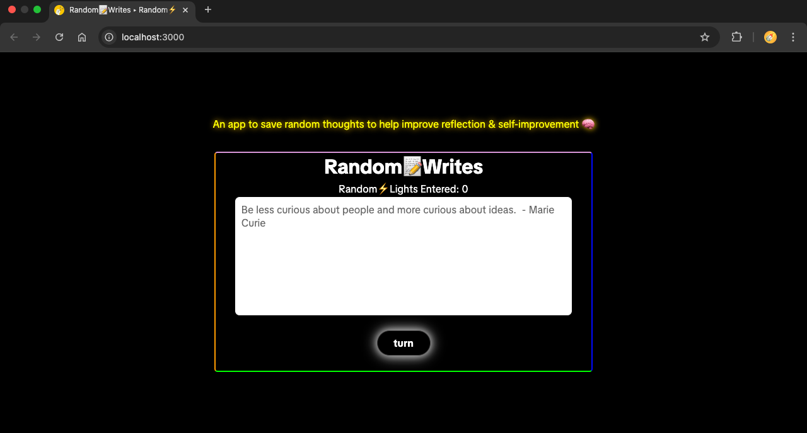
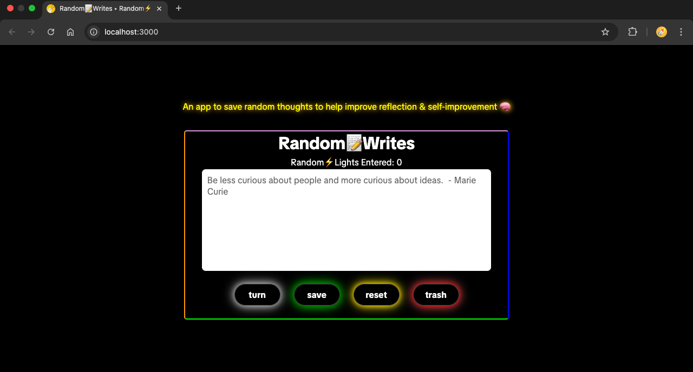

# Random Writes • Random Lights

## Frontend Tech Stack: 
HTML | CSS | JavaScript | Vite

## About
Simple & fun web-interface for recording thoughts.
Inspired by the **Build A Passenger Counter App** found on **scrimba.com - Learn JavaScript for beginners**

Save any random thought while online; sometimes when I get random thoughts and I start to write them down, I then begin to dig deeper and often realize my random thoughts are sometimes trying to tell me a more important message.

### Initial Screen
When you first open the app, you’ll see the base layout with one menu button displayed.

---

### Menu Buttons Shown
Here, I’ve expanded the menu to show all buttons.  
These buttons can disappear and reappear depending on user event.

